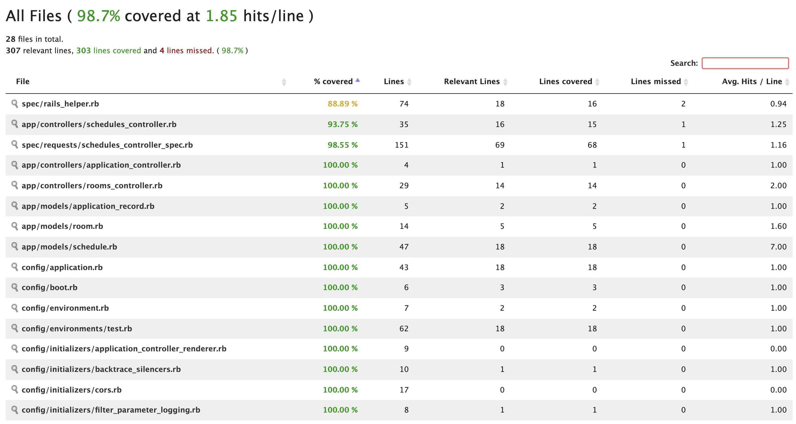

# Descrição do Problema

Temos um problema grande com reuniões, elas são muitas e temos poucas salas disponíveis.

Precisamos de uma agenda para nos mantermos sincronizados e esse será seu desafio!

Temos 4 salas e podemos usá-las somente em horário comercial, de segunda a sexta das 09:00 até as 18:00.

Sua tarefa será de criar uma API REST que crie, edite, mostre e delete o agendamento dos horários para que os usuários não se percam ao agendar as salas.

  

# Notas

- O teste deve ser escrito utilizando Ruby e Ruby on Rails

- Utilize as gems que achar necessário

- Não faça squash dos seus commits, gostamos de acompanhar a evolução gradual da aplicação via commits.

- Estamos avaliando coisas como design, higiene do código, confiabilidade e boas práticas

- Esperamos testes automatizados.

- A aplicação deverá subir com docker-compose

- Crie um README.md descrevendo a sua solução e as issues caso houver

- O desafio pode ser entregue abrindo um pull request ou fazendo um fork do repositório

  
  

##  Lista de Conteúdos

  

[Descrição](#descrição)

  

[Gems instaladas](#gems-instaladas)

  

[Rodando a aplicação](#rodando-a-aplicação-arrow_forward)

  

[Rodando os testes](#rodando-os-testes-memo)

  

[Rotas](#rotas)

  

[Considerações](#considerações)

  
  

##  Descrição

<p  align="justify"> Desafio ninja é uma Api utilizada para gerenciar a agenda de reuniões, das quais podem ser realizadas das 9:00 as 18:00 UTC -3, ou seja das 12:00 as 21:00 UTC, nos dias úteis de uma semana, podendo ser criadas, editadas ou deletas

</p>

  

##  Gems instaladas

  

<p  align="justify"> As gems instaladas nessa aplição e suas dependências podem ser encontradas no arquivo Gemfile e Gemfile.lock respctivamente

  

* ruby '3.0.3'

  

* rails '6.1.4.4'

  

* byebug, usado como debugger

* factory_bot_rails, para auxiliar na criação de testes

* rspec-rails, para a execução de testes

* rubocop utilizado como linter

* shoulda-matchers, para vereficar de formas mais simples e confiável as validações de modelo

* simplecov, garantir uma cobertura adqueada de testes

 </p>

  

##  Rodando a aplicação

  
1. Clone o repositório

```
git clone https://github.com/namae-no-nai/desafio-ninja
```
2. Build a aplicação
```
docker-compose build
```
3. Setup do banco de dados, criação, aplicação das migrações e a seed
```
docker-compose rails db:create db:migrate db:seed
```
4. Execute a aplicação
```
docker-compose up
```

A aplicação rodará na porta local 30000 => http://localhost:3000.

  

##  Rodando os testes

  
<p  align="justify">Para a rodar os testes é necessário executar</p>
 
 ```
docker-compose run web rspec
```

<p  align="justify">Além dos testes ele deverá exibir a cobertura de testes fornecida pelo simplecov</p>

<p  align="justify">Outros comandos úteis são</p>

```
docker-compose run web rubocop
```
<p  align="justify">Faz o lint do código da aplicação e </p>

```
docker-compose run web rails c
```

<p  align="justify">Permite o acesso ao console da aplicação </p>



##  Rotas

<p  align="justify"> As rotas para utilização da API são : </p>
  
* Para listar as salas e respectivas reuniões

````
GET base_url/rooms
````

* Para a inserção de novas reuniões
```
POST base_url/rooms/room.id/add_schedule
{
	"schedule": {
	"begin_time": "2022-01-03T20:00:00.000Z",
	"end_time": "2022-01-03T21:00:00.000Z"
	}
}
```

* Para a edição de reuniões já agendadas
```
PUT base_url/schedules/schedule.id
{
	"schedule": {
	"begin_time": "2022-01-03T20:00:00.000Z",
	"end_time": "2022-01-03T21:00:00.000Z"
	}
}
```

* Para deletar reuniões agendadas
```
DELETE base_url/schedules/schedule.id
```

##  Considerações

<p  align="justify">O código foi feito com intuíto de rodar uma aplicação simples, portanto sem maiores preocupações em relação a escalabilidade, Os horários enseridos devem ser usados em UTC, e podem ser configurados adcionando a linha de código com o horário local desejado </p>

```
config.time_zone = 'Brasilia'
```
<p  align="justify"> e mudar o intervalo fornecido na função available_schedule_time_window? do arquivo schedule.rb para o novo intervalo desejado </p>
<p  align="justify"> Outro ponto a ser melhorado é o dinamismo tanto dos testes quando de parte do código para comportar diferentes fuso horários </p>